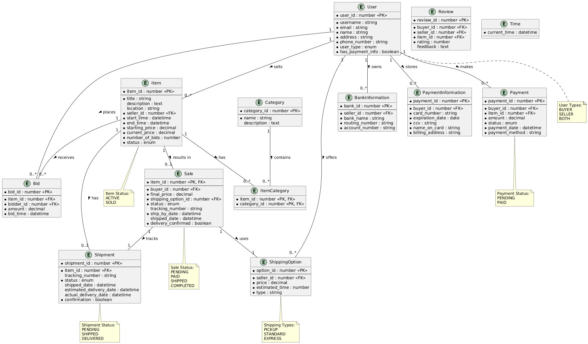

# AuctionBase System

## Overview
A auction database system that handles auction functionality: bidding, sales, and user management.

## Features
- User registration (buyers and sellers)
- Item listing
- Basic bidding system
- Payment verification
- Delivery tracking
- Simple review system

## Database Structure

### Core Tables
- Time (system time tracking)
- Users (user information)
- Items (auction items)
- Categories (item categories)
- Bids (bid tracking)
- Sales (completed transactions)
- Reviews (user feedback)
- PaymentInfo (payment verification)

### Views
- CurrentTime (system time)
- ActiveItems (available auctions)
- ItemBids (bid statistics)
- PendingShipments (items to be shipped)
- UnconfirmedDeliveries (pending confirmations)

## Core Constraints
1. Valid user types (BUYER, SELLER, BOTH)
2. Positive starting prices
3. Valid auction timeframes
4. No self-bidding
5. No duplicate bids
6. Valid bid amounts
7. Payment verification before bidding
8. Two-day shipping requirement

## Stored Procedures
- SetTime (update system time)
- ProcessAuction (handle auction completion)
- ConfirmDelivery (mark delivery complete)

## File Structure
```
AuctionBase/
├── 1_database_setup.sql     # Database initialization
├── 2_create_tables.sql      # Table definitions
├── 3_indexes_constraints.sql # Database constraints
├── 4_triggers.sql           # System triggers
├── 5_views.sql             # Database views
├── 6_initial_data.sql      # Sample data
├── 7_stored_procedures.sql # Stored Procedures
├── README.md               # This file
└── auction.jpg             # Database diagram
```

## Database Diagram


## Requirements
- MySQL 5.7 or higher

## Setup Instructions
1. Run database setup: `1_database_setup.sql`
2. Create tables: `2_create_tables.sql`
3. Add constraints: `3_indexes_constraints.sql`
4. Create triggers: `4_triggers.sql`
5. Create views: `5_views.sql`
6. Load data: `6_initial_data.sql`
7. Stored Procedures `7_stored_procedures.sql`

## Notes
- System uses a single time table for auction management
- All bids must be verified against current system time
- Payments must be verified before bidding
- Shipping deadlines are enforced by triggers
